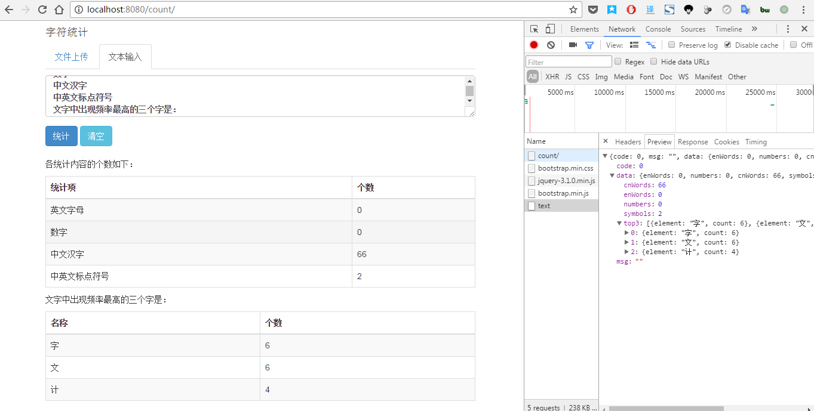
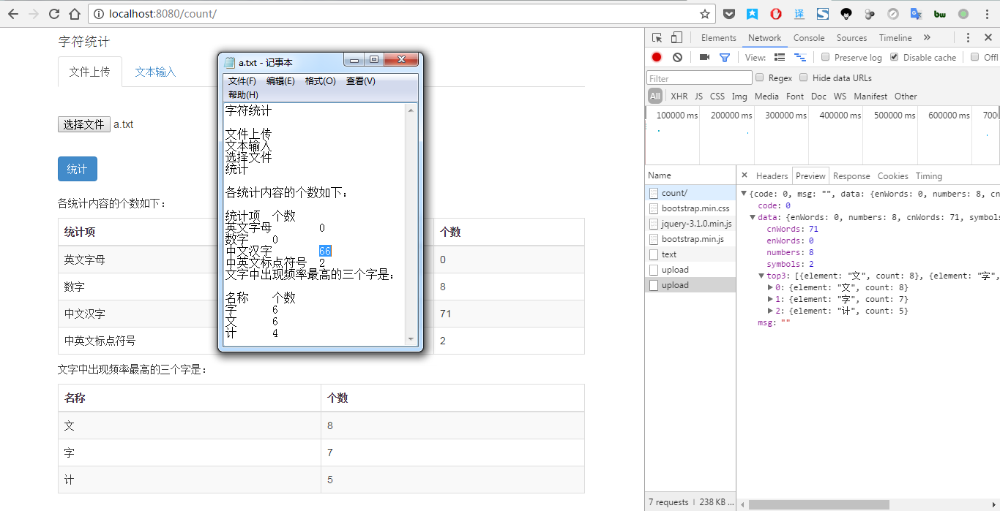

# 题目命名：CharacterCounter
统计一段文字中（①文本输入方式——要求完成、②文件上传方式——选做）
英文字母、数字、中文汉字、中英文标点符号的个数，
以及文字中出现频率最高的三个字符（出现频率相同的，按字典顺序排）。

- 点击“统计”按钮，以表格的形式显示以上统计结果，如下图所示。
- 文本输入方式下，点击“清除内容”按钮可清空文本框中的内容。

要求：使用 Spring MVC

详细请看：[2017应届生DEV大作业.pdf](2017应届生DEV大作业.pdf)

## 效果
文字：

文件：
